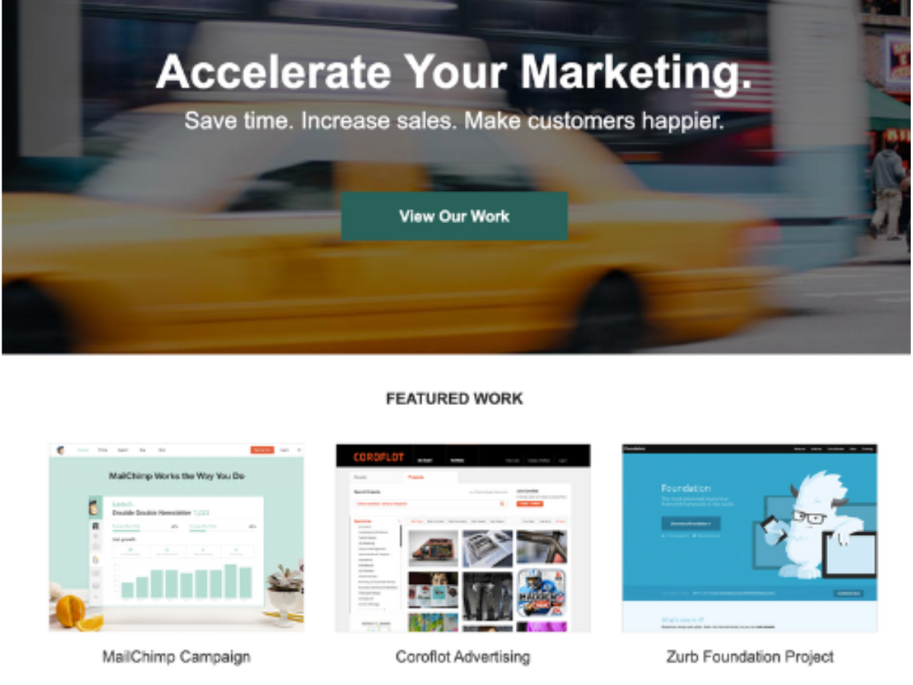

# WordPress Development for Fictional Marketing Agency

WordPress site with Custom Themes, Child Themes, and Advanced Theme Customizations

## Tools & Skills
- MySQL
- PHP
- WordPress
- Plugins
- Visual Studio Code
- SiteGround

## Acknowledgements
This is a custom WordPress site developed for a <a href="https://skillcrush.com/" target="_blank">Skillcrush</a> course. 

## My Customizations
I customized the project by implementing a mobile-first strategy and adding customer quotes on the homepage, replacing a Twitter feed in the original design.

## Future development
- Improve accessibility of color contrast
